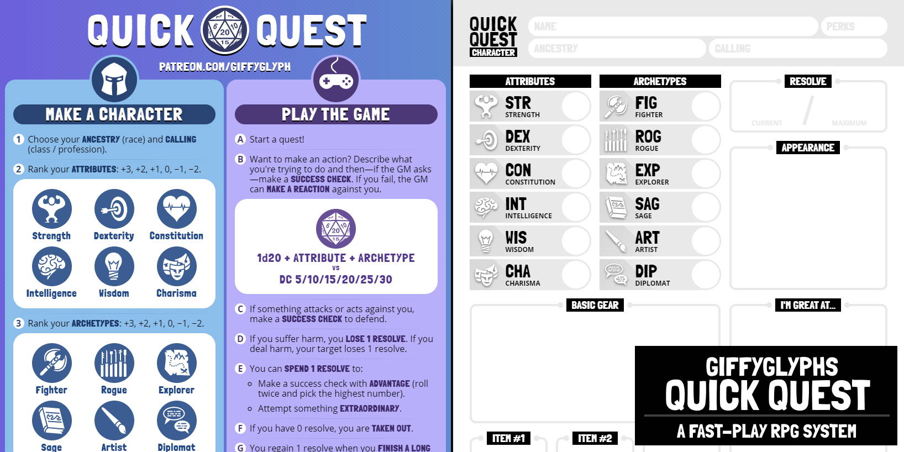
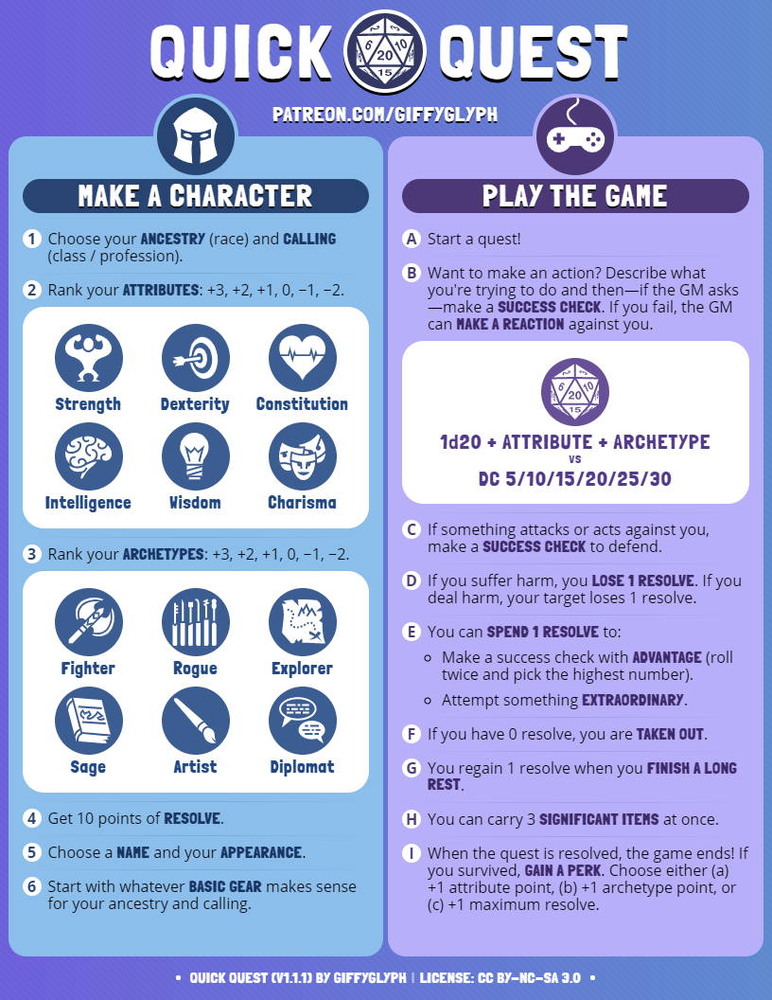
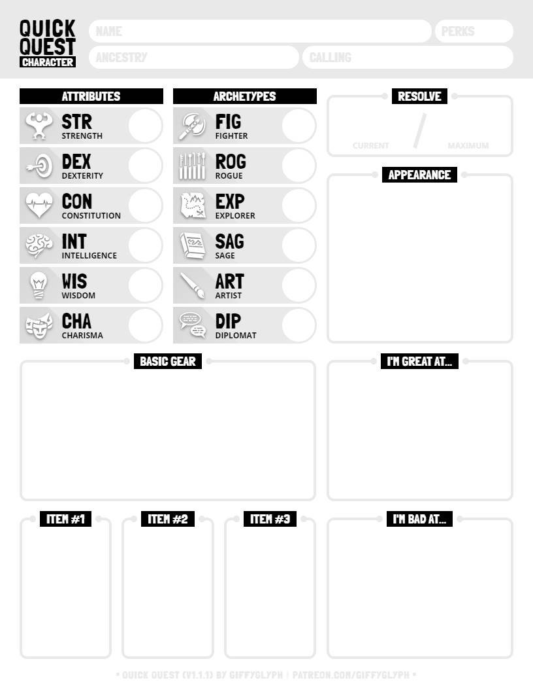

# Giffyglyph's Quick Quest

Want to start playing an RPG in just five minutes with just one d20 die? Then try **Giffyglyph's Quick Quest**—a 1-page RPG system with a narrative, fast-play focus. Use it for low fantasy quests, high fantasy quests, horror quests, sci-fi quests—whatever your adventuring tastes, **Quick Quest** isn't picky.

* Get the PDF: [English](https://github.com/giffyglyph/giffyglyphs-quick-quest/releases/download/v1.1.1/giffyglyphs_quick_quest_v1_1_1_en.pdf), [French](https://github.com/giffyglyph/giffyglyphs-quick-quest/releases/download/v1.1.1/giffyglyphs_quick_quest_v1_1_1_fr.pdf), [Spanish](https://github.com/giffyglyph/giffyglyphs-quick-quest/releases/download/v1.1.1/giffyglyphs_quick_quest_v1_1_1_es.pdf)
* [Read the Changelog](https://github.com/giffyglyph/giffyglyphs-quick-quest/blob/master/docs/CHANGELOG.md) 

## Features

* Start playing a game in 5 minutes.
* Easy-to-grok for D&D/Pathfinder players.
* Great for one-shots and introducing new players and kids to D&D.
* Includes a **character sheet** and **questboard** for easy prep.
* Now translated into **French** and **Spanish**.

| Rules                                                | Character Sheet                                          |
| ---------------------------------------------------- | -------------------------------------------------------- |
|  |  |

## Roadmap

To see what's being worked on right now—and what may be planned for the future—check out the **[projects board](https://github.com/giffyglyph/giffyglyphs-quick-quest/projects)**.

## Bugs and Feature Suggestions

If you notice a bug or have a feature suggestion, visit the **[issue board](https://github.com/giffyglyph/giffyglyphs-quick-quest/issues)** and open a ticket. Please make sure to be as thorough as possible in your report and attach screenshots where appropriate, as low-effort tickets may be closed out-of-hand.

### Want to add a translation?

1. Make a copy of [/src/translations/en.txt](/src/translations/en.txt).
2. Rename your file using the [ISO 639-1 code](https://www.loc.gov/standards/iso639-2/php/code_list.php) for your language.
3. Translate all the text strings, making sure to maintain any html elements (e.g. strong/span).
4. Let me know about your changes, either by making a pull request or by sending me the translations directly. Once merged, I'll generate a new translated pdf for the language (when verified).
5. Let me know what name you'd like to be credited by.

## Support

If you'd like to see more from this project in future, please consider [becoming a patron](https://www.patreon.com/giffyglyph). You can also find more of my work at:

* [giffyglyph.com](https://giffyglyph.com)
* [twitter](https://twitter.com/giffyglyph)
* [twitch.tv/giffyglyph](https://twitch.tv/giffyglyph)

## Licensing

This work is licensed under a [Creative Commons Attribution-NonCommercial-ShareAlike 4.0 International License](http://creativecommons.org/licenses/by-nc-sa/4.0/).

